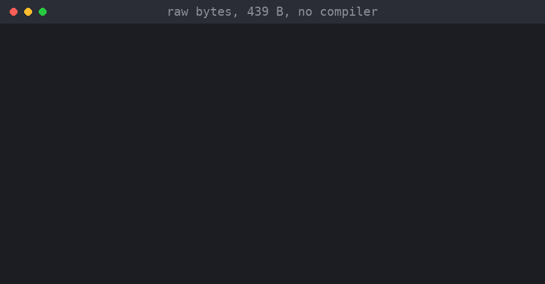
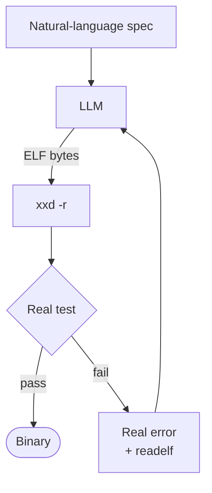
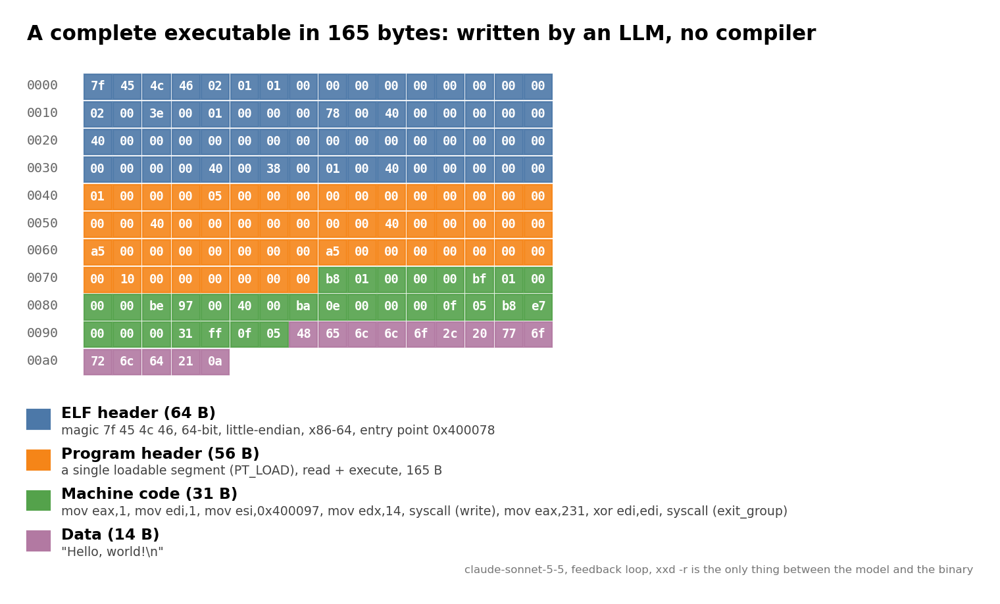
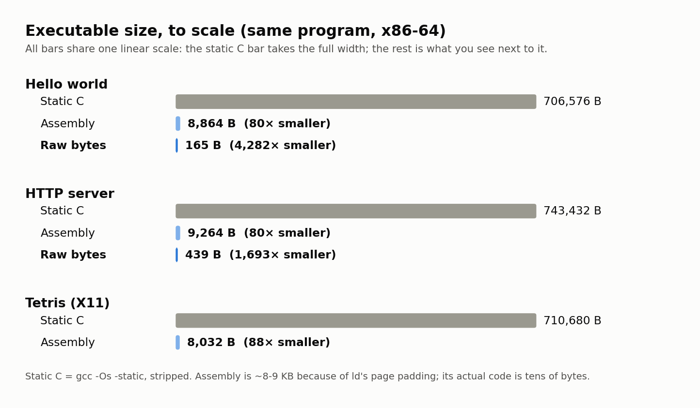

# NLC: an LLM that writes executables directly

**No source language. No compiler. No assembler. No linker.**
Give an LLM a natural-language spec and it returns the *bytes of the executable*: ELF header, program header and machine code, by hand. The only thing between the model and the binary is `xxd -r`.



*A 439-byte HTTP server, generated from a one-paragraph spec. That's the real output of the generated binary.*

I've been running this experiment every time a new model comes out for a couple of years, and this is the first time the results are good enough to share.

You could say it isn't a compiler in the classical sense, but a model acting as the entire compiler (analysis, code generation, assembling and linking) in a single step, inside a loop that corrects it.

## How it works

The loop is a bash script of about 100 lines. It hands the spec to the model (`claude -p`), turns whatever comes back into a binary, and tests it for real: it runs it, sends it a `curl` if it's a server, or compares a screenshot against a reference if it's a game. If it fails, the error goes back to the model exactly as it came out (exit code, output, what `readelf` sees in the file), and it starts over until the test passes or the attempts run out. Nobody is in the middle.



To see how far down the stack a model can go with no human in the loop, the same loop runs at three levels:

| Level | Harness | The model emits | Toolchain |
|---|---|---|---|
| A | `harness/run_loop.sh` | single-file C | `gcc` |
| B | `harness/run_loop_asm.sh` | assembly, raw syscalls, no libc | `as` + `ld` |
| C | `harness/run_loop_rawbytes.sh` | **the whole ELF as hex bytes** | none (`xxd -r`) |

Level C is the interesting one. A complete 165-byte hello world, byte by byte:



## How big is it?

Compared with statically linked C, since these binaries use no library at all:

| Program | Static C (`gcc -Os -static`, stripped) | Assembly (`as` + `ld`) | Reduction | Raw bytes | Reduction |
|---|---:|---:|---:|---:|---:|
| hello world | 706,576 | 8,864 | 80× | **165** | **4,282×** |
| HTTP server | 743,432 | 9,264 | 80× | **439** | **1,693×** |
| Tetris (X11) | 710,680 | 8,032 | 88× | n/a | n/a |



Caveats: a plain dynamically linked `gcc hello.c` is ~15 KB, but it depends on `libc.so` and the dynamic loader, which aren't counted. The 8-9 KB of the assembly versions is mostly the padding `ld` adds to align to 4 KB pages (the hello world has 47 bytes of code). With `musl`, static C would shrink noticeably; I haven't measured it.

## Does it actually work?

With several attempts, the loop ends up producing a working program at all three levels, including raw bytes. It's not reliable at the bottom level, though. Five independent runs per case, x86-64, `claude-sonnet-5-5`:

| Program | C | Assembly | Raw bytes |
|---|---:|---:|---:|
| hello world | 5/5 | 5/5 | 4/5 |
| HTTP server | 5/5 | 5/5 | 2/5 |

(Runs per case that passed within the iteration budget: 5-6 attempts for C, 6-8 for assembly, 8-15 for raw bytes. Median attempts for the passing runs: 1-2 for C and assembly, 1 for the raw-bytes hello world and 5 for the raw-bytes server.)

It also generated a playable **Tetris in assembly** (X11, no libc, talking to the X server over its Unix socket), about 8 KB, checked by comparing screenshots against a reference at four moments: piece spawn, move, rotate, and lock with a line clear.


*Controls: `a` left, `d` right, `s` soft drop, `w` rotate (click the window to focus it). The keys in the GIF are sent by a script.*

## What failed

The first time I tried raw bytes on x86-64 everything failed: 8/8 attempts on the hello world and 15/15 on the server. The model wrote one extra hex digit in a long run of zeros in the header, so everything after it shifted by half a byte. To `readelf` it was still a valid ELF, but with absurd sizes, and running it gave a segfault.

A segfault tells the model nothing. I started sending back the real size of the file and what `readelf` actually decodes (entry point, `FileSiz`, `MemSiz`, etc.), and it began passing. I can't say how much of that is the change and how much is luck; I didn't measure it properly. The failed logs are kept as `run.v1-failed.log`.

## What this isn't

- **Not deterministic.** The same spec can come out in one attempt or in six.
- **Small programs.** A 439-byte server isn't a browser; how far this scales, I don't know.
- **Model-dependent.** Results above are Claude Sonnet 5.5 on x86-64 (AArch64 runs used a different model, so the two aren't comparable).
- **The tests do the work.** What works is the model plus the automated verification, not the model alone.
- **It runs model-generated binaries.** Don't run this on a machine you care about without reading what it does first.

## Why I think it's interesting

- **Fewer resources.** 439 bytes vs ~700 KB for static C. On microcontrollers or embedded systems that matters, but it's a toy server: real savings depend on how much of a program is your own logic and how much a library gives you.
- **No dependencies.** No `libc` means nothing to go out of date and no inherited vulnerabilities, since the program talks straight to the kernel. But the generated code can have its own bugs and has no years of scrutiny behind it. You trade one risk for another.
- **Exotic architectures.** I've only tried x86-64 and AArch64, which have plenty of compilers, so this is untested. But if a model can hand-encode an architecture's instructions and ELF header, you may not need a compiler for it. I'm leaving that as a question.
- **The spec as source code.** What you maintain is the natural-language spec and the tests; the binary is a regenerable intermediate result. I'm not saying this replaces programming languages, but it changes what gets maintained.
- **What worries me.** A hand-written binary is hard to audit (you can disassemble it, but it's not the same as reading source), and non-determinism makes reproducing it harder. That's why the automated tests aren't an afterthought.

There's also the question of malicious use. A model generating executables that differ every time and carry no compiler or linker fingerprints could slip past signature-based detection better. I don't see this as a radically new risk: modern detection mostly looks at behavior, which stays visible when the bytes change, and a model can already write harmful code in C or assembly. I haven't tried it and it isn't the goal; I'm mentioning it because it should be said.

## Try it

```sh
git clone https://github.com/lusob/nlc && cd nlc
ARCH=x86_64 harness/run_loop_rawbytes.sh examples/hello-world-rawbytes 8 <model>

# <example-dir> [max_iters] [model]   (default model: fable)
harness/run_loop.sh          examples/hello-world           # C,   default 5 iters
harness/run_loop_asm.sh      examples/hello-world-asm       # asm, default 6 iters
harness/run_loop_rawbytes.sh examples/hello-world-rawbytes  # raw, default 8 iters
```

**Requirements:** Linux (AArch64 or x86-64), Bash, `xxd`, `readelf`, `curl`, `python3`, GNU `binutils` and `gcc` for levels A/B, and the Claude CLI logged in. `ARCH=aarch64|x86_64` picks the target (default: `uname -m`); pass your model as the third argument.

Each example directory has everything the loop needs:

```
examples/<name>/
├── spec.md          # natural-language spec (the ONLY input the model gets)
├── spec.x86_64.md   # arch-specific spec, when the ABI matters
├── smoke_test.sh    # verification gate: takes the binary as $1, exit 0 = pass
├── main.c|.s|.hex   # generated source (level-dependent)
└── run.log          # full transcript of the loop (iterations + feedback)
```

x86-64 runs and logs are in `results/x86_64/`; the 5-run repetitions are in `results/x86_64-runs/`.

### X11 examples

`spec.md` uses `@@XAUTH_COOKIE@@` instead of a cookie; the harness fills it at run time from `xauth list $DISPLAY` (`harness/xauth_cookie.sh`). The committed `main.s` files have the cookie bytes zeroed, so they won't authenticate as-is: re-run the loop on your own machine to regenerate them. Under Wayland you need XWayland.

## More results

Earlier AArch64 runs (model `fable`, native Linux AArch64), iteration that passed / budget:

| Example | Variant | Result | Binary size |
|---|---|---:|---:|
| `hello-world` | C | 1/5 | 71,624 B |
| `hello-world-asm` | asm | 1/6 | 1,072 B |
| `hello-world-rawbytes` | raw bytes | 5/8 | **166 B** |
| `mini-webserver` | C | 2/6 | 75,992 B |
| `mini-webserver-asm` | asm | 2/8 | 1,784 B |
| `mini-webserver-rawbytes` | raw bytes | 4/15 | 696 B |
| `x11-m1-handshake-asm` | asm (X11 handshake + auth) | 4/15 | n/a |
| `tetris-t1-core-asm` | asm (Tetris on X11, size-minimization exercise) | 2/25 | 6,752 B |

First x86-64 run (single run, `claude-sonnet-5-5`):

| Example | Variant | Result | Binary size |
|---|---|---:|---:|
| `hello-world` | C | 1/5 | n/a |
| `hello-world-asm` | asm | 1/6 | n/a |
| `hello-world-rawbytes` | raw bytes | 1/8 | 165 B |
| `mini-webserver` | C | 2/6 | n/a |
| `mini-webserver-asm` | asm | 2/8 | n/a |
| `mini-webserver-rawbytes` | raw bytes | 6/15 | 439 B |
| `x11-m1-handshake-asm` | asm | 1/6 | 9,344 B |
| `tetris-t1-core-asm` | asm (X11) | 5/25 | 8,032 B |

Specs deliberately pin down every byte-level detail (struct layouts, endianness, syscall numbers, exact response strings), so the smoke test is unambiguous and the failure feedback is actionable.

## License

MIT, see [LICENSE](LICENSE).
